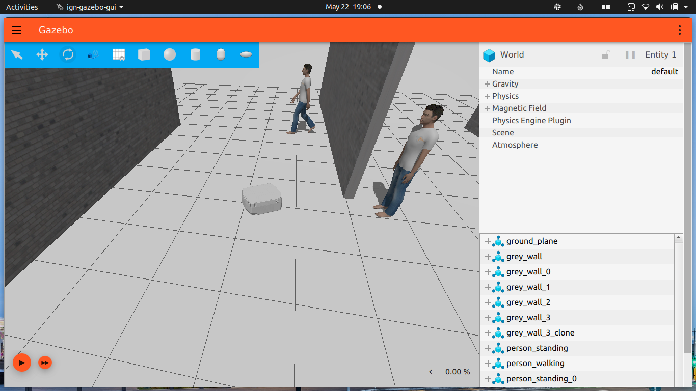

# Igt One

## Installation
  * Install [Ignition-Edifice](https://ignitionrobotics.org/docs/edifice/install_ubuntu) or greater.
  * Build ros_ign packages for foxy from [source](https://github.com/ignitionrobotics/ros_ign) as the binaries on apt are only supported for Ignition-Citadel as of now so some features might not work with the package from apt.
  
* Create a workspace

```bash

mkdir -p colcon_ws/src && cd colcon_ws/src
```

  * Clone the repo
  * Build the workspace & source the setup 
 
```bash
colcon build --symlink-install

source install/setup.bash
```
## Launch

>Ign-Gazebo

```bash
ros2 launch igt_ignition igt_ignition.launch.py
```




### Launch with <code>ros_ign_bridge</code> for teleop

```bash
ros2 launch igt_ignition igt_ignition.launch.py with_bridge:=true
```
and then open another terminal and run
```bash
ros2 run teleop_twist_keyboard teleop_twist_keyboard
```

### Publish velocities using <code>ign topic</code>

```bash
ign topic -t "/model/igt_one/cmd_vel" -m ignition.msgs.Twist -p "linear: {x: 2.0}, angular: {z: 0.0}"
```

### Subscribe to topics using <code>ign topic</code>

```bash
ign topic -t "/igt_one/laserscan" -e
```
```bash
ign topic -t "/model/igt_one/odometry" -e
```
# Navigation

### Mapping with Slam Toolbox
 * Install [slam_toolbox](https://github.com/SteveMacenski/slam_toolbox) from apt for ros2 foxy using:
   ```bash
   sudo apt install ros-foxy-slam-toolbox
   ```
 * Launch the simulation in ignition gazebo with ros_ign_bridge using:
   ```bash
   ros2 launch igt_ignition igt_ignition.launch.py with_bridge:=true
   ```
 * Open another terminal and launch slam_toolbox for mapping and rviz2 using `online_sync_launch.py` from `igt_nav` package:
   ```bash
   ros2 launch igt_nav online_sync_launch.py
   ```
 * Open another terminal and run the ros2 `teleop_twist_keyboard` node using:
   ```bash
   ros2 run teleop_twist_keyboard teleop_twist_keyboard
   ```
 * Use teleop to control the bot and map the world (as shown in the gif below). Save the map using:
   ```bash
   ros2 run nav2_map_server map_saver_cli -f name_of_map_file
   ```
   

### Navigation2
 * Install [navstack2](https://navigation.ros.org/build_instructions/index.html) for ros foxy.
 * Launch the simulation in ignition gazebo using:
   ```bash
   ros2 launch igt_ignition igt_ignition.launch.py with_bridge:=true
   ```
 * Launch navigation2 using `navigation2.launch.py` launch file:
   ```bash
   ros2 launch igt_nav navigation2.launch.py
   ```
   This launches the `bringup.launch.py` launch file from `nav2_bringup` package and `map/lab_map.yaml` and `config/nav2.yaml` from igt_nav package as map and params_file. It also runs the rviz2 node with nav2 rviz config from nav2_bringup package.
 * In rviz2, use `2D Pose Estimate` to provide initial pose of the bot to amcl so that it can start publishing the robot's pose & `map->odom tf`.
 * After providing the initial pose of the bot you will see the rviz2 window updating with estimated robot pose from amcl as well as updated global and local costmap. Use the `2D Goal Pose` in rviz2 to provide the bot with a goal pose to start navigation. (shown below in gif) <br> <br>
   
