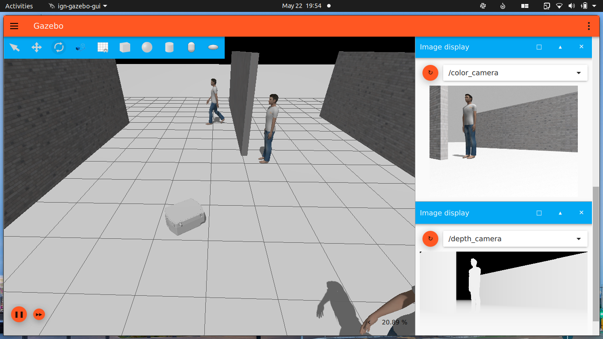

# Igt One

## Installation
  * Install [Ignition-Edifice](https://ignitionrobotics.org/docs/edifice/install_ubuntu)
  * Create a workspace

```bash

mkdir -p colcon_ws/src && cd colcon_ws/src
```

  * Clone the repo
  * Build the workspace & source the setup 
 
```bash
colcon build --symlink-install

source install/setup.bash
```
## Launch

>Ign-Gazebo

```bash
ros2 launch igt_ignition igt_ignition.launch.py
```




### Publish velocities using <code>ign topic</code>

```bash
ign topic -t "/model/igt_one/cmd_vel" -m ignition.msgs.Twist -p "linear: {x: 2.0}, angular: {z: 0.0}"
```

### Subscribe to topics using <code>ign topic</code>

```bash
ign topic -t "/igt_one/laserscan" -e
```
```bash
ign topic -t "/model/igt_one/odometry" -e
```
